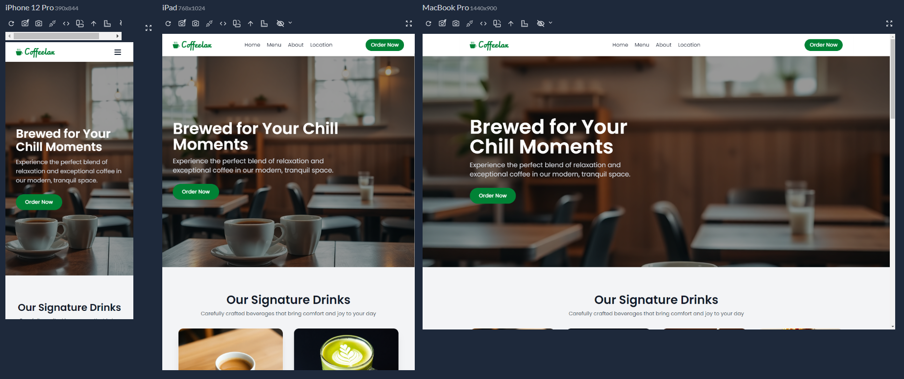

# ☕ Coffeelax – Tailwind Café Landing Page

A calm, modern, and fully responsive **Café landing page** designed and developed with **Tailwind CSS** — featuring accessible navigation, grid-based drink menus, smooth transitions, and responsive interactions.  
Crafted by **Stephen William G. De Jesus**, this project demonstrates modern layout design, ARIA accessibility, responsive Tailwind components, and aesthetic UI animation patterns for a café brand.

---

## 📸 Preview  

### 🎞️ Live Interaction (GIF)  


### 🖼️ Full Page Screenshot 


### 📱 Responsive View (Mobile, Tablet & Tablet)  


---

## 🌐 Live Demo  
[View Live Demo](https://bogiiiie.github.io/08-tailwind-cafe-landing-page/)

---

## 📁 Features

✅ Smooth-scrolling navigation bar with ARIA roles  
✅ Fully responsive grid-based **Signature Drinks** section  
✅ Scroll-snap hero with layered image + black overlay for text contrast  
✅ Animated burger menu with accessible toggle on smaller screens  
✅ Grid layout for café features and location details  
✅ Newsletter subscription form with accessible labels and buttons  
✅ Footer with social media icons using **Bootstrap Icons**  
✅ Consistent spacing and font styling using Tailwind’s utility classes  
✅ Color palette and brand identity matching a chill café vibe  

---

## 🛠️ Built With

- **Tailwind CSS** – utility-first responsive framework  
- **HTML5** – semantic markup and accessibility attributes  
- **Google Fonts** – [Poppins](https://fonts.google.com/specimen/Poppins) & [Edu NSW ACT Cursive](https://fonts.google.com/specimen/Edu+NSW+ACT+Cursive)  
- **Bootstrap Icons** – for decorative and functional UI icons  

---

## 🚀 Getting Started

To run this project locally:

```bash
git clone https://github.com/yourusername/08-tailwind-cafe-landing-page.git
cd coffeelax-landing-page
open index.html
